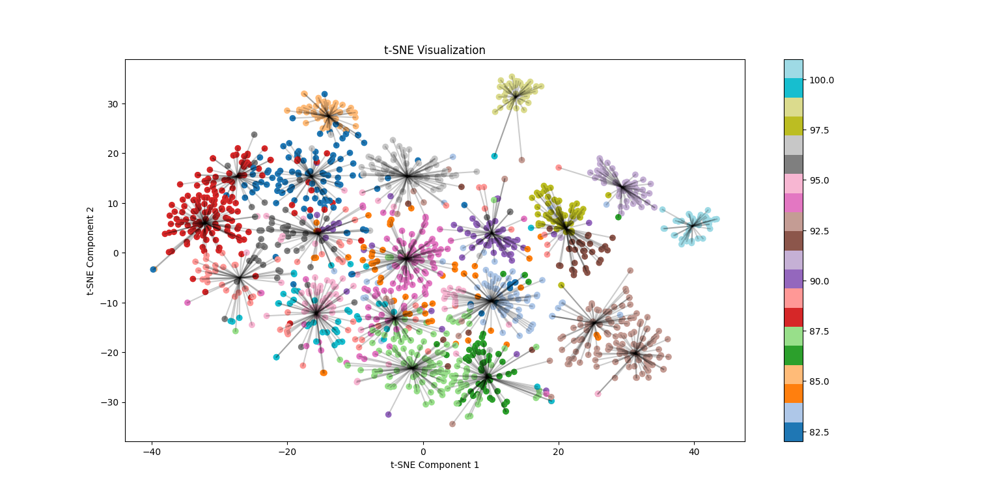

# ImageRetrieval
## Installation

To use the ImageRetrieval package, you can follow these installation steps:

### 1. Clone the repository:

    ```bash
    git clone https://github.com/your-username/your-repo.git
    cd your-repo
    ```


### 2. Install the `ImageRetrieval` package itself:

    ```bash
    pip install .
    ```

    This will automatically install packages

### 3. You're all set! Now lets look at results from our approach


| Configuration | Model                      | Loss Functions                              | Feature Dim | Augmentation | ROC-AUC |
|---------------|----------------------------|---------------------------------------------|-------------|--------------|---------|
| 0             | Resnet50                   | -                                           | -           | -            | 0.75    |
| 1             | Resnet50                   | CenterLoss + CrossEntropy                  | 512         | False        | 0.815   |
| 2             | Resnet50                   | CenterLoss + CrossEntropy + ArcFaceLoss    | 512         | True         | 0.84    |
| 3             | Resnet50                   | CenterLoss + CrossEntropy + ArcFaceLoss    | 4096        | True         | 0.85    |
| 4             | Resnet101                  | CenterLoss + CrossEntropy + ArcFaceLoss    | 4096        | True         | 0.87    |
| 5             | Hybrid_CNN_Transformer     | CenterLoss + CrossEntropy + ArcFaceLoss    | 8192        | True         | 0.9     |

### Explanation

In this project, a range of model configurations were explored to improve image retrieval performance, with ROC-AUC scores used as the evaluation metric.

- **Resnet50 Inference (Frozen Layers)**: The initial model achieved a ROC-AUC of 0.75.
- **Resnet50 with CenterLoss + CrossEntropy**: Introducing the CenterLoss and CrossEntropy loss functions along with a feature dimension of 512 improved the performance to a ROC-AUC of 0.815.
- **Resnet50 with CenterLoss + CrossEntropy + ArcFaceLoss**: Adding ArcFaceLoss and enabling augmentation further improved performance, yielding a ROC-AUC of 0.84.
- **Resnet50 with CenterLoss + CrossEntropy + ArcFaceLoss (FeatureDim=4096)**: Increasing the feature dimension to 4096 while retaining augmentation led to a ROC-AUC of 0.85.
- **Resnet101 with CenterLoss + CrossEntropy + ArcFaceLoss (FeatureDim=4096)**: Using a Resnet101 model with augmented feature dimensions achieved a ROC-AUC of 0.87.
- **Hybrid CNN-Transformer (Resnet101 + SwinTransformer)**: Combining a Resnet101 CNN with a SwinTransformer and augmenting the feature dimension to 8192 resulted in an exceptional ROC-AUC of 0.9.

These configurations showcase the impact of diverse strategies on the ROC-AUC score, with augmentation, feature dimension adjustments, and hybrid architectures playing significant roles in performance enhancements. The success of the hybrid model underscores the benefits of integrating transformer-based features alongside CNNs.

---

Feel free to copy and paste this content into your GitHub README as desired.

## t-SNE Visualization of Classes



The image above showcases the t-SNE visualization of classes, offering insights into the distribution of your data
